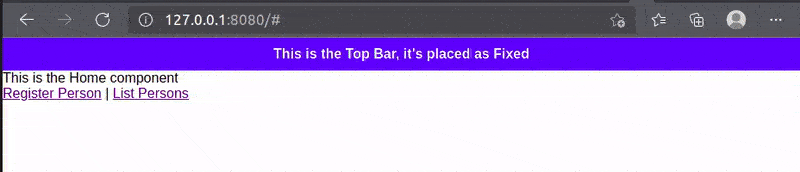

### Overview

App template is the skeleton where the high level/base layout divisions are set/defined. When it comes to layout, it's common to have it dividide into parts like 
"Navigation Bar", "Top Menu", "Main Section", "Header", "Footer", etc. Those definitions are easily managed by adding on the App Template.


The default App Template includes a single <b>`<still-component>`</b> tag, which renders the active component based on routing or first component Loading set in the <b>StillAppSetup</b>. It must appear only once and is required in <b>`app-template.js`</b>. To add persistent UI parts, use <b>`<st-fixed>`</b> with a <b>`component`</b> property—these remain visible across navigations.


!!! warning "Lone component considerations"
    Because AppTemplate is tied to the Still Application container, it's not available when using Lone component becuase in therms of rendering they are totally depending on the environment in which they being embeded.

<br>

### Standard AppTemplate (<b>`app-template.js`</b>) after initiating a project

=== "app-setup.js"
	```js title="This is the where Application context aspects are setup. This file is in the root folder. " hl_lines="18" linenums="1"
    import { Template } from "./@still/component/super/Template.js";

    export class AppTemplate extends Template {

        /**
         * <still-component> is the placeholder where components 
         * should be render both when loading or routing to the component
         * 
         * <still-fixed> is the specification of a specific component part from the 
         * User interface that needs to be fiexed (e.g. Header, Footer, Menu, Navigation, etc.)
         * 
         * THIS SHOULD BE CHANGED ACCORDING TO MY LAYOUT WHERE I'M HAVING COMPONENTS FOR
         * EACH PART AND THE FIXED ONES WIIL BE REFERENCED AS <st-fixed> AND THE COMPONENT
         * TO BE RENDERED WILL BE PASSED AS THE VALUES OF component PROPERTY OF <st-fixed>
         * e.g. <st-fixed component="AppHeader">
         */
        template = `
            <still-component/>
        `;

    }
	```

<br><br>


#### Defining Application top Bar with fixed part

As stated above, AppTemplate fixed part stays stick even when there is navigation. Follow the bellow example:

=== "app-template.js"
	```js title="Fixed parte in line 18 - This is part of the framework and it's in the project root folder" hl_lines="18" linenums="1"
    import { Template } from "./@still/component/super/Template.js";

    export class AppTemplate extends Template {

        /**
         * <still-component> is the placeholder where components 
         * should be render both when loading or routing to the component
         * 
         * <still-fixed> is the specification of a specific component part from the 
         * User interface that needs to be fiexed (e.g. Header, Footer, Menu, Navigation, etc.)
         * 
         * THIS SHOULD BE CHANGED ACCORDING TO MY LAYOUT WHERE I'M HAVING COMPONENTS FOR
         * EACH PART AND THE FIXED ONES WIIL BE REFERENCED AS <st-fixed> AND THE COMPONENT
         * TO BE RENDERED WILL BE PASSED AS THE VALUES OF component PROPERTY OF <st-fixed>
         * e.g. <st-fixed component="AppHeader">
         */
        template = `
            <st-fixed component="TopBar"/>
            <still-component/>
        `;

    }
	```

=== "TopBar.js"
	```js title="This component is placed inside app/component/bar/ folder" hl_lines="18" linenums="1"
    import { ViewComponent } from "../../../@still/component/super/ViewComponent.js";

    export class TopBar extends ViewComponent {

        isPublic = true;
        template = `
            <div class="main-top-bar">
                This is the Top Bar, it's placed as Fixed
            </div>

            <style>
                .main-top-bar {
                    padding: 10px 3px;
                    background: blue;
                    color: white;
                    text-align: center;
                    font-weight: bold;
                }
            </style>
        `;

    }
	```

=== "HomeComponent.js"
	```js title="This component is placed inside app/home/ folder" hl_lines="9 11" linenums="1"
    import { ViewComponent } from "../../@still/component/super/ViewComponent.js";

    export class HomeComponent extends ViewComponent {

        isPublic = true;
        template = `
            <div>
                <p>This is the Home component</p>
                <a href="#" (click)="goto('RegistrationForm')">Register Person</a>
                |
                <a href="#" (click)="goto('ListPersons')">List Persons</a>
            </div>
        `;

    }
	```

=== "RegistrationForm.js"
	```js title="This component is placed inside app/components/person/ folder" hl_lines="9 11" linenums="1"
    import { ViewComponent } from "../../../@still/component/super/ViewComponent.js";

    export class RegistrationForm extends ViewComponent {

        isPublic = true;
        template = `
            <h1>
                <p>Person Registration</p>
                <a href="#" (click)="goto('HomeComponent')">Goto Main menu</a>
                |
                <a href="#" (click)="goto('ListPersons')">Register Person</a>
            </h1>
        `;
    }
	```

=== "ListPersons.js"
	```js title="This component is placed inside app/components/person/ folder" hl_lines="9 11" linenums="1"
    import { ViewComponent } from "../../../@still/component/super/ViewComponent.js";

    export class ListPersons extends ViewComponent {

        isPublic = true;
        template = `
            <h1 style="color: green;">
                <p>This is the ListPersons Component</p>
                <a href="#" (click)="goto('HomeComponent')">Goto Main menu</a>
                |
                <a href="#" (click)="goto('ListPersons')">Register Person</a>
            </h1>
        `;

    }
	```

<b>Animated result:</b>



<br><br>


#### Creating a menu using Fixed parts

A fixed part recives the component just like <b>`<st-element>`</b>, such component works the same way a component works in other scenarios inspit being fixed, for this reason we can leverage it for creating more interactive parts like menus.

When using navigation in the fixed part, it does not affect the part itself, but the <b>`<still-component/>`</b> part of the <b>`AppTemplate`</b>, this makes fixed part the suitable place for transversal menus.

=== "app-template.js"
	```js title="Fixed parte in line 18 - This is part of the framework and it's in the project root folder" hl_lines="18" linenums="1"
    import { Template } from "./@still/component/super/Template.js";

    export class AppTemplate extends Template {

        /**
         * <still-component> is the placeholder where components 
         * should be render both when loading or routing to the component
         * 
         * <still-fixed> is the specification of a specific component part from the 
         * User interface that needs to be fiexed (e.g. Header, Footer, Menu, Navigation, etc.)
         * 
         * THIS SHOULD BE CHANGED ACCORDING TO MY LAYOUT WHERE I'M HAVING COMPONENTS FOR
         * EACH PART AND THE FIXED ONES WIIL BE REFERENCED AS <st-fixed> AND THE COMPONENT
         * TO BE RENDERED WILL BE PASSED AS THE VALUES OF component PROPERTY OF <st-fixed>
         * e.g. <st-fixed component="AppHeader">
         */
        template = `
            <st-fixed component="TopBar"/>
            <still-component/>
        `;

    }
	```

=== "TopBar.js"
	```js title="This component is placed inside app/component/bar/ folder" hl_lines="8 10 12" linenums="1"
    import { ViewComponent } from "../../../@still/component/super/ViewComponent.js";

    export class TopMenu extends ViewComponent {

        isPublic = true;
        template = `
            <div class="top-menu-container">
                <a href="#" (click)="goto('HomeComponent')">Home</a>
                |
                <a href="#" (click)="goto('RegistrationForm')">Register Person</a>
                |
                <a href="#" (click)="goto('ListPersons')">List Persons</a>
            </div>

            <style>
                .top-menu-container a { color: white; }
                
                .top-menu-container {
                    padding: 10px 3px;
                    background: blue;
                    font-weight: bold;
                }

            </style>
        `;

    }
	```

=== "HomeComponent.js"
	```js title="This component is placed inside app/home/ folder" linenums="1"
    import { ViewComponent } from "../../@still/component/super/ViewComponent.js";

    export class HomeComponent extends ViewComponent {

        isPublic = true;
        template = `
            <div>
                <p>This is the Home component</p>
            </div>
        `;

    }
	```

=== "RegistrationForm.js"
	```js title="This component is placed inside app/components/person/ folder" linenums="1"
    import { ViewComponent } from "../../../@still/component/super/ViewComponent.js";

    export class RegistrationForm extends ViewComponent {

        isPublic = true;
        template = `
            <h1>
                <p>Person Registration</p>
            </h1>
        `;
    }
	```

=== "ListPersons.js"
	```js title="This component is placed inside app/components/person/ folder" linenums="1"
    import { ViewComponent } from "../../../@still/component/super/ViewComponent.js";

    export class ListPersons extends ViewComponent {

        isPublic = true;
        template = `
            <h1 style="color: green;">
                <p>This is the ListPersons Component</p>
            </h1>
        `;

    }
	```

<b>Animated result:</b>


<br><br>

### Application Stylization

At the end of the Day the AppTemplate sits on the of the stillUiPlaceholder which is an HTML <b><div></b> placed in the <b>`index.html`</b> placed in the project root folder, for this reason this (<b>`index.html`</b>) is the right to use as the source of the App UI styling for the layout by including our <b>`.css`</b> files in there.


=== "index.html"
	```html title="Adding my stilesheet file in line 9 - This is a framework file located in the project root folder" linenums="1" hl_lines="9"
    <!DOCTYPE html>
    <html lang="en">

    <head>
        <meta charset="UTF-8">
        <meta http-equiv="X-UA-Compatible" content="IE=Edge">
        <meta content="width=device-width, initial-scale=1" name="viewport" />
        <title>StillJS</title>
        <link href="path/to/mystyling.css" rel="stylesheet">
        <link href="@still/ui/css/still.css" rel="stylesheet">
        <script src="@still/index.js" type="module"></script>
    </head>

    <body>
        <div id="stillUiPlaceholder"></div>
    </body>
	```

<br><br>