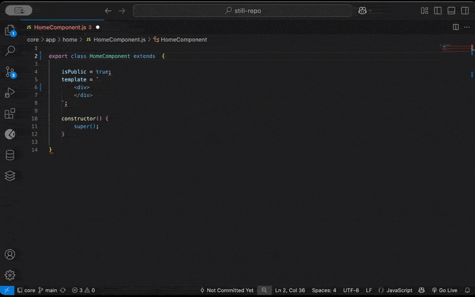

### Overview
Bacuase <b>`still-cli`</b> is a Vanilla JavaScript Framework that leverages ES module capabilities, when auto-importing one file into another it's required the .js to be in place (see examples bellow), however the editor (e.g. VS Code) won't do that automatically, hence we need a basic setup.

```js
//This is correct importing
✅ import { module } from "MyModule.js";

//This is wrong importing, will result on net::ERR_ABORTED 404 (Not Found)
❌ import { module } from "MyModule";
```

<br>

#### Configure VSCode to add .js when auto-import



<br>
