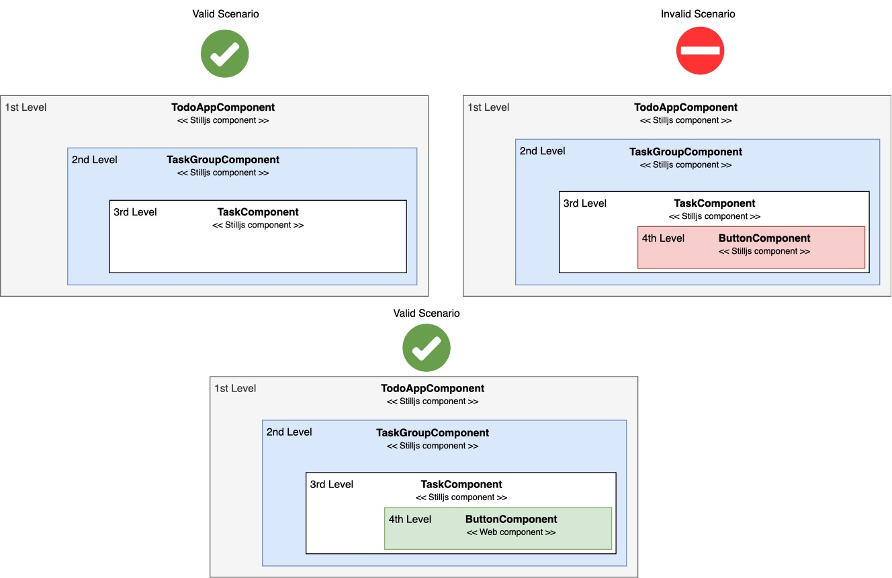

### Multi-level nesting component with 3+ offsprings

### Overview

Frameworks use custom tags that browsers don't recognize, leading to heavy and recursive computation. To reduce this, Still.js limits component nesting to three levels—Grandparent → Parent → Child, thereby improving performance and minimize computation.

However, Stilljs yet encourages the use of more than 3 levels of nesting, given that from the 4th level it should be used `Web Component` register to the browser. It's recommended for those to be light component like generics widgets (e.g. button, card, wrapper, template).

<br><br>
#### Nesting component scenarios



<br>

#### Design perspective - Addressing Nested component
In design, nesting components should be done only when necessary. For example, in a <b>product list</b>, unless they are reused elsewhere, elements like <b>`buttons`</b> or <b>`images`</b> does not need to be separate components, they can be kept inside Product component. Even if subparts present some complexity,   overengineering ca be avoided by planing component structure thoughtfully.


<br>


#### Embeding Web component inside Still.js component:

Web Components are registered with the browser, making them fully recognized and manageable custom tags that support unlimited nesting. Still.js leverages them effectively due to its vanilla JavaScript foundation. 

Bellow is the project structure for this coming example:

=== ":octicons-project-roadmap-16: Project folder structure"
    ```js title="Project folder structure"
    project-root-folder
    |__ @still/
    |__ app/
    |    |
    |    |__ components/
    |    |   |__ Home.js
    |    |__ webcomponents/
    |    |   |__ CustomRedDiv.js
    |    |   |   |
    |__ config/
    |    |__ app-setup.js
    |__  ...

    ```


=== "app-setup.js"

    ```js title="" linenums="1" hl_lines="4 12 13"

    import { StillAppMixin } from "../@still/component/super/AppMixin.js";
    import { Components } from "../@still/setup/components.js";
    import { HomeComponent } from "../app/home/HomeComponent.js";
    import { CustomRedDiv } from "../app/wcomp/CustomRedDiv.js";
    import { AppTemplate } from "./app-template.js";

    export class StillAppSetup extends StillAppMixin(Components) {

        constructor() {
            super();
            this.setHomeComponent(HomeComponent);
            // This is the custom web component
            this.register(CustomRedDiv);
        }

        async init() {
            return await AppTemplate.newApp();
        }

    }

    ```


=== "CustomRedDiv.js"

    ```js title="Web Component" linenums="1"

    export class CustomRedDiv extends HTMLElement {

        connectedCallback(){
                
            const wrappedContent = this.innerHTML;
            const style = `
                <style>
                    custom-red-div div{ border: 1px solid red; }
                </style>
            `;
            // Content that will be displayed in the when the component renders 
            this.innerHTML = `${style}<div>${wrappedContent}</div>`;
        }
    }

    window.customElements.define('custom-red-div', CustomRedDiv);

    ```


=== "CustomRedDiv.js"

    ```js title="Web Component" linenums="1" hl_lines="10"

    import { ViewComponent } from "../../@still/component/super/ViewComponent.js";

    export class Home extends ViewComponent {

        isPublic = true;

        template = `
        <div>
            My Home content
            <custom-red-div>This content is handled by Web component</custom-red-div>
        </div>
        `;

    }

    ```

In the example, the Web Component is placed in a separate webcomponents folder for clarity, but it could just as well be stored alongside regular Still.js components in the same folder.

Once created, the Web component needs to be register in the Still application context so it becomes available accross all other components through the application.


### In Summary
Still.js supports component nesting up to 3 levels (parent → child → grandchild). For deeper levels, it recommends using Web Components starting from the great-grandchild level onward.

Limiting to 3 nesting levels maintains performance; beyond that, use Web Components since they're directly registered, managed and parsed by the browser.


## Enjoy nesting component