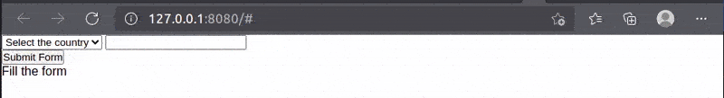
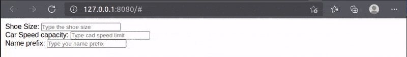

### Overview
Directives is a way in Still.js to deal with some UI specific features on the template side of things, which also provides capabilities to handle DOM tree and elements eliminating the need for diracte manipulating it in some specific situations.

In Still.js, directives are added as HTML tag properties enclosed in parentheses (e.g., (click)), visually distinguishing them from standard HTML attributes.

There are some directives available, and they are addressing things in different categories such as <b>`event binding`</b>, <b>`form binding`</b>, <b>`looping`</b>, <b>`rendering`</b> & <b>`conditional`</b>, <b>`form validation`</b>, follow a list bellow:


### Event Directive

Those directives allow to tie specific kind of event to HTML form input by specifying the component method to be called, follow the list: 

<table class="annotations">
    <tr>
        <td style="background: lightgrey;">Directive</td>
        <td style="background: lightgrey;"><b>Applicable to</b></td>
        <td style="background: lightgrey;"><b>Description</b></td>
        <td style="background: lightgrey;"><b>Use context</b></td>
    </tr>
    <tr>
        <td>(click)</td>
        <td>Any HTML element/tag</td>
        <td>It adds the click event to the target element by providing access to the component methods.</td>
        <td>
            <ul>
                <li>Any event click implementation calling component method</li>
            </ul>
        </td>
    </tr>
    <tr>
        <td>(change)</td>
        <td>HTML &lt;select>/combobox element</td>
        <td>It binds a component method to a combo-box allowing detect change on it.</td>
        <td>
            <ul>
                <li>Any event click implementation calling component method</li>
            </ul>
        </td>
    </tr>
</table>

<br>

#### The <b>`(click)`</b> Directive example:

Click event binding considering a component implemented method.

=== "template"

    ```html title="This is the template code snippet" hl_lines="7-8 10 12-13 18-19 25 30" linenums="1"
    <button (click)="increment()">count-state (@countVariable) +</button>
    <button (click)="decrement()">count-state (@countVariable) -</button>
    ```

=== "component"

    ```js title="This is the component code snippet" linenums="1"
    countVariable = 0;

    // This is going to be bound to the template via (click) directive
    increment(){
        this.countVariable = this.countVariable.value + 1;
    }

    // This is going to be bound to the template via (click) directive
    decrement(){
        this.countVariable = this.countVariable.value - 1;
    }
    ```

<br>
<br>
#### The <b>`(change)`</b> Directive example:

Change event binding for HTML &lt;select> tag/combobox ti check whenever a value gets selected.

=== "template"

    ```html title="This is the template code snippet" linenums="1"
    <form>
        <select (change)="callIfChanging($event)">
            <option value="">Select the country</option>
            <option value="1">Austria</option>
            <option value="2">Bulgaria</option>
            <option value="3">Canada</option>
        </select>
    </form>
    ```


=== "component"

    ```js title="This is the component code snippet" linenums="1"
    // This is going to be bound to the template via (change) directive
    callIfChanging(e) {
        console.log(`Country selected value is: `, e.target.value);

    }
    ```

Changes in the regular HTML input can be handled through the state change in the bound state as shown in the (value) directive example.


!!! info "Event Binding considerations"
    In general, Still.js concerns especially with click event not to miss the capability to bind component methods, anyway, therefore, when it comes to other events (except for onchange for combobox) the approach to follow is regular DOM manipulation and JavaScript since Still.js is pure javaScript.

<br><br>
<a name="container-directive"></a>
### Container Directives

Those directives are placed in any HTML element that can enclose other elements thereby providing features like looping through a list, rendering/not rendering, hide/unhide:

<table class="annotations">
    <tr>
        <td style="background: lightgrey;">Directive</td>
        <td style="background: lightgrey;"><b>Applicable to</b></td>
        <td style="background: lightgrey;"><b>Description</b></td>
        <td style="background: lightgrey;"><b>Use context</b></td>
    </tr>
    <tr>
        <td>(forEach)</td>
        <td>Any HTML wrapper elemen (e.g. &lt;div>, &lt;section>, &lt;span>, &lt;select>, etc.)</td>
        <td>Allow looping through a list of elements while printing each element in the UI.</td>
        <td>
            <ul>
                <li>Generating data for Datatable</li>
                <li>Looping to a list for a combobox</li>
                <li>Mapping a list to cards</li>
                <li>etc.</li>
            </ul>
        </td>
    </tr>
    <tr>
        <td>(renderIf)</td>
        <td>Any HTML wrapper elemen (e.g. &lt;div>, &lt;section>, &lt;span>, &lt;select>, etc.)</td>
        <td>Render/Not render an element according to a flag value (true/false)</b></td>
        <td>
            <ul>
                <li>Prevent application part/section not to render</li>
                <li>Suitable for user permission content render manipulation</li>
            </ul>
        </td>
    </tr>
    <tr>
        <td>(showIf)</td>
        <td>Any HTML wrapper elemen (e.g. &lt;div>, &lt;section>, &lt;span>, &lt;select>, etc.)</td>
        <td>Hide/Unhide render an element according to a flag value (true/false)</b></td>
        <td>
            <ul>
                <li>Hide/Unhide UI part according to business rules.</li>
            </ul>
        </td>
    </tr>
</table>


<br>

#### The <b>`(forEach)`</b> Directive example:

It loops through a list/array of any type of element allowing the maping of it to some kind of desirable output.

=== "template"

    ```html title="This is the template code snippet" linenums="1"
    <!-- Outermost container -->
    <div>
        <!-- Looping container -->
        <span (forEach)="frutList">
            <div each="item">
                Fruit: {item.name} | Color: {item.color}
            </div>
        </span>
    </div>
    ```

=== "component"

    ```js title="This is the component code snippet" linenums="1"
    // This is a state variable in the componet with an array of objects
    frutList = [
        { name: 'Banana', color: 'yellow' },
        { name: 'Apple', color: 'red' },
        { name: 'Grapes', color: 'violet' },
    ]
    ```

<b>Result</b>:


<br>
<br>
<a href="render-if"></a>

#### The <b>`(renderIf)`</b> Directive example:

This comes into place especially in it comes to handle parts of the App that can or cannot render according to the user permission, if it does not reneders, it woun't even in the DOM tree.

=== "template"

    ```html title="This is the template code snippet" linenums="1"
    <div>
        This is a regular content which does not require permision
        <div (renderIf)="self.isUserAdmin">
            This requires user permission to render
        </div>
    </div>
    ```


=== "component"

    ```js title="This is the component code snippet" linenums="1"
    // Flag needs to be component prop, hence they're annotated with it
    /** @Prop */ 
    isUserAdmin = false;
    ```

(renderIf) works with flag, which true will make it to render, and false not. The flag is defined in the component itself and needs to be annotated with <b>`@Prop`</b> annotation. When referencing the flag variable it's required to use the <b>`self.`</b> prefix.


<br>
<br>
#### The <b>`(showIf)`</b> Directive example:

In contrast to <b><a href="#render-if">(renderIf)</a></b>, the <b>(showIf)</b> is to be used if we still need to render the UI/component part but keep it hidden.

=== "template"

    ```html title="This is the template code snippet" linenums="1"
    <div>
        <p>
            Click to hide/unhide the date
        </p>
        <button (click)="handleShowDate()">Hide/Unhide date</button>
        <div (showIf)="self.shouldShowDate">
            Today is @todayDate
        </div>
    </div>
    ```


=== "component"

    ```js title="This is the component code snippet" linenums="1"
    // Because we don't need to listen to changes, the variable is turned to Prop
    /** @Prop */
    todayDate = new Date().toDateString();

    /** @Prop */
    shouldShowDate = true;

    handleShowDate() {
        this.shouldShowDate = !this.shouldShowDate;
    }
    ```

(renderIf) works with flag, which true will make it to render, and false not. The flag is defined in the component itself and needs to be annotated with <b>`@Prop`</b> annotation. When referencing the flag variable it's required to use the <b>`self.`</b> prefix.

<b>Animated result:</b>


<br><br>


### Form Binding Directives

Directives in the Form binding category allows to handle 2-way binding as wey as handle validation as needed when dealing with form submit, follow hte list:


<table class="annotations">
    <tr>
        <td style="background: lightgrey;">Directive</td>
        <td style="background: lightgrey;"><b>Applicable to</b></td>
        <td style="background: lightgrey;"><b>Description</b></td>
        <td style="background: lightgrey;"><b>Use context</b></td>
    </tr>
    <tr>
    <tr>
        <td>(formRef)
            <dependent-l class="tooltip">
                dependent
                <span class="tooltiptext">Depends on validator directives: <br>(required) or (validator)</span>
            </dependent-l>
        </td>
        <td>HTML form/form tag</td>
        <td>Privides a form referance variable to allow handling form validation, however, only makes sense if validation is in place</td>
        <td>
            <ul>
                <li>Form validation on submit</li>
            </ul>
        </td>
    </tr>
    <tr>
        <td>(value)</td>
        <td>HTML form input element (e.g. &lt;input>, &lt;select>, <span style='color: red;'>except for radio and checkbox</span>, as thier bind is done with <b>(field)</b> directive instead)</td>
        <td>Provides two-way binding for a form input against a component state</td>
        <td>
            <ul>
                <li>Two-way between component state variable and a Form input.</li>
                <li>On the Radio button and Checkbox only serves to bind value, but not property.</li>
            </ul>
        </td>
    </tr>
    <tr>
        <td>(field)</td>
        <td>HTML form, Radio button and Checkboxes</td>
        <td>Provides two-way binding for a form input against a component state</td>
        <td>
            <ul>
                <li>Two-way between component state variable and a Form Radiobutton and/or Checkbox input</li>
            </ul>
        </td>
    </tr>
    <tr>
        <td>(labelAfter)</td>
        <td>Radio button and Checkboxes text label</td>
        <td>Puts the specified text label right after (beside) the Radiobutton/Checkbox</td>
        <td>
            <ul>
                <li>Presenting label to the used</li>
            </ul>
        </td>
    </tr>
    <tr>
        <td>(labelBefore)</td>
        <td>Radio button and Checkboxes text label</td>
        <td>Puts the specified text label right before (beside) the Radiobutton/Checkbox</td>
        <td>
            <ul>
                <li>Presenting label to the used</li>
            </ul>
        </td>
    </tr>
</table>

<br>

<a name="form-ref-example"></a>

#### The <b>`(formRef)`</b> Directive example:

For <b>`(formRef)`</b> to be effective, form inputs must use validation directives, be bound to component state variables via <b>`(value)`</b>, and include either <b>`(required)`</b> and/or <b>`(validator)`</b> directives to enable validation.

=== "template"

    ```html title="This is the template code snippet" linenums="1"
    <div>
        <!-- formRef is a variable inside the component -->
        <form (formRef)="myForm">
            <!-- Both (value) and (required) are present and mantadory for validation -->
            <select (required)="true" (value)="myCountry">
                <option value="">Select the country</option>
                <option value="1">Austria</option>
                <option value="2">Bulgaria</option>
                <option value="3">Canada</option>
            </select>
            <!-- Both (value) and (required) are present and mantadory for validation -->
            <input type="text" (value)="myField" (required)="true">
        </form>
        <!-- sendForm() method will use the (formRef) to check validation -->
        <button (click)="sendForm()">Submit Form</button>
    </div>
    ```


=== "component"

    ```js title="This is the component code snippet" linenums="1"
    //Because we don't need to listen to changes we're turning form-ref to Prop
    /** @Prop  */
    myForm;
    //This state is bound to form combobox
    myCountry;
    //This state is bound to form input
    myField;
    //This state is bound the template
    submissionResult = `Fill the form`;

    sendForm() {
        //Validate method runs and returns validation result
        const isValid = this.myForm.validate();
        if (isValid) {
            this.submissionResult = `
                <span style="color: green;">
                    Form subitted successfully.
                </span>
            `;
        }
    }
    ```

At the end of the day, the validation variable which is assigned to the <b>`(formRef)`</b> then is provided with <b>`validate()`</b> method among others, when it gets call, if all validations are passing it'll return true, otherwise it's false, see the result:

<b>Animated result:</b>



<br>
<br>

#### The <b>`(value)`</b> Directive example:

In addition to be a complement for the <b>`(formRef)`</b> when it comes to validation, <b>`(value)`</b> directive allows 2-way biding with component state variables.

=== "template"

    ```html title="This is the template code snippet" linenums="1"
    <div style="padding: 10px;">
        <form>
            <select (value)="myCountry">
                <option value="">Select the country</option>
                <option value="Austria">Austria</option>
                <option value="Bulgaria">Bulgaria</option>
            </select>
            <input type="text" (value)="myField">
        </form>
        <p><b>Selected country:</b> @myCountry</p>
        <p><b>My Field value:</b> @myField</p>
        <button (click)="autoFill()">Auto-fill the form</button>
        <button (click)="emptyCountry()">Clear Country</button>
    </div>
    ```


=== "component"

    ```js title="This is the component code snippet" linenums="1"
    // We need to listen to changes of both, hence they're state (not @Prop annotated)
    myCountry = '';
    myField = '';

    autoFill() {
        this.myCountry = 'Bulgaria';
        this.myField = 'Default value';
    }

    emptyCountry() {
        this.myCountry = '';
    }
    ```

(renderIf) works with flag, which true will make it to render, and false not. The flag is defined in the component itself and needs to be annotated with <b>`@Prop`</b> annotation. When referencing the flag variable it's required to use the <b>`self.`</b> prefix.

<b>Animated result:</b>


<br>
<br>


<a name="form-validation-directives"></a>

### Form Validation Directives

Validation Directives make it quite easy to handle validation in Still.js very few lines where only the directive concerning the specific validation needs to be used, follow hte list:


<table class="annotations">
    <tr>
        <td style="background: lightgrey;">Directive</td>
        <td style="background: lightgrey;"><b>Applicable to</b></td>
        <td style="background: lightgrey;"><b>Description</b></td>
        <td style="background: lightgrey;"><b>Use context</b></td>
    </tr>
    <tr>
        <td>(required)</td>
        <td>HTML form input element (e.g. &lt;input>, &lt;select>)</td>
        <td>Mark a form elemen as required which gets triggered when validation checked through <b>(formRef)</b></td>
        <td>
            <ul>
                <li>Form validation on submit</li>
            </ul>
        </td>
    </tr>
    <tr>
        <td>(validator)</td>
        <td>HTML &lt;input> tag</td>
        <td>Specify of valid data type for an input field</td>
        <td>
            <ul>
                <li>Hide/Unhide UI part according to business rules.</li>
            </ul>
        </td>
    </tr>
    <tr>
        <td>
            (validator-max) 
            <dependent-l class="tooltip">
                dependent
                <span class="tooltiptext">Depends (validator)</span>
            </dependent-l>
        </td>
        <td>HTML numeric &lt;input> tag</td>
        <td>Specify the max value allowed in the field</td>
        <td>
            <ul>
                <li>Limit the maximun numeric threshold.</li>
            </ul>
        </td>
    </tr>
    <tr>
        <td>
            (validator-max-warn) 
            <dependent-l class="tooltip">
                dependent
                <span class="tooltiptext">Depends (validator)</span>
            </dependent-l>
        </td>
        <td>HTML numeric &lt;input> tag</td>
        <td>Specify message to display if max allowed value is violeted</td>
        <td>
            <ul>
                <li>Customize max limit warning message.</li>
            </ul>
        </td>
    </tr>
    <tr>
        <td>
            (validator-min) 
            <dependent-l class="tooltip">
                dependent
                <span class="tooltiptext">Depends (validator)</span>
            </dependent-l>
        </td>
        <td>HTML numeric &lt;input> tag</td>
        <td>Specify the min value allowed in the field</td>
        <td>
            <ul>
                <li>Limit the minimun numeric threshold.</li>
            </ul>
        </td>
    </tr>
    <tr>
        <td>
            (validator-min-warn) 
            <dependent-l class="tooltip">
                dependent
                <span class="tooltiptext">Depends (validator)</span>
            </dependent-l>
        </td>
        <td>HTML numeric &lt;input> tag</td>
        <td>Specify message to display if min allowed value is violeted</td>
        <td>
            <ul>
                <li>Customize min limit warning message.</li>
            </ul>
        </td>
    </tr>
    <tr>
        <td>
            (validator-trigger) 
            <dependent-l class="tooltip">
                dependent
                <span class="tooltiptext">Depends (validator)</span>
            </dependent-l>
        </td>
        <td>HTML &lt;input> tag</td>
        <td>Specify <b>(validator)</b> should trigger (e.g. when typing, when focus, when blur)</td>
        <td>
            <ul>
                <li>Customize min limit warning message.</li>
            </ul>
        </td>
    </tr>
</table>

<br><br>

#### The <b>`(required)`</b> Directive example:

It defines the HTML form field/input element as mandatory thereby making it marked for validation, therefore, proper validation requires the form to have a reference (<a href="#form-ref-example">see this example</a>), and validation is verified through it.

<br><br>

#### The <b>`(validator)`</b> Directive example:

This directive works with <b>`(value)`</b> to define valid input types for form elements. Still.js offers 7 default validators, and custom validators can also be implemented. 

**Follow the built-in Validators:**

- ***number*** - Allow only number in the target filed
- ***alphanumeric*** - Allow both number and text but not special characters
- ***text*** - Allow anything
- ***email*** - Allow email only
- ***phone*** - Allow Telephone number format
- ***date*** - Allow data
- ***dateUS*** - Allow date in USA format

<br>
<br>

#### Using a validator

To use it we only need to assign its name to the directive (e.g. <b>`(validator)="number"`</b>) hence, every name has to be unique.

=== "template"

    ```html title="This is the template code snippet" linenums="1" hl_lines="6-7 17-18"
    <div style="padding: 10px;">
        <form>
            <div class="input-group">
                <label for="">Country:</label>
                <select 
                    (validator)="text"
                    (value)="myCountry" 
                >
                    <option value="">Select the country</option>
                    <option value="Austria">Austria</option>
                    <option value="Bulgaria">Bulgaria</option>
                </select>
            </div>
            <div class="input-group">
                <label for="">Shoe Size:</label>
                <input 
                    (value)="shoeSize" 
                    (validator)="number" 
                    placeholder="Type the shoe size"
                >
            </div>
        </form>
    </div>
    ```


=== "component"

    ```js title="This is the component code snippet" linenums="1"
    // We only need the state variable that are bound to the form inputs
    myCountry = '';
    shoeSize;
    ```

<b>Animated result:</b>


When used in an input text field, unless we override the trigger (by defining <b>`(validator-trigger)`</b> directive) the validation happens as  we type the value. When it comes to combo-box, the validator only takes affect through the <b>`(formRef)`</b> by calling <b>`.validate()`</b> as in <a href="#form-ref-example">this example</a>.

<br>
<br>

#### Implementing Custom Validator

Custom validators are typically added at the application level in <b>`StillAppSetup`</b> (<b>`app-setup.js`</b>). However, they can also be registered elsewhere, like directly within a component, using the <b>`.addValidator()`</b> utility method.

=== "template"

    ```html title="Custom validator - first 2 are implemented inside the AppSetup, the last one is in the component itself" linenums="1" hl_lines="7 14 25"
    <div style="padding: 10px;">
        <form>
            <div class="input-group">
                <label for="">Shoe Size:</label>
                <input 
                    (value)="shoeSize" 
                    (validator)="twoNumberOnly" 
                    placeholder="Type the shoe size">
            </div>
            <div class="input-group">
                <label for="">Car Speed capacity:</label>
                <input 
                    (value)="speedCapacity" 
                    (validator)="max3Chars" 
                    placeholder="Type cad speed limit">
            </div>
            <!-- 
             The above validators are implemented in the StillAppSetup, 
             whereas the bellow one is in the component 
            -->
            <div class="input-group">
                <label for="">Name prefix:</label>
                <input 
                    (value)="namePrefix" 
                    (validator)="prefixValidator" 
                    placeholder="Type you name prefix">
            </div>
        </form>
    </div>
    ```


=== "component"

    ```js title="This is the component code snippet" linenums="1"
    // The states that are bound to the form
    shoeSize;
    speedCapacity;
    namePrefix;

    stOnRender() {
        // A custom validator added before the component is rendered
        StillAppSetup.addValidator('prefixValidator', (value) => {
            if (value === 'First-' || value === 'Sec-')
                return true;
            return false;
        });
    }
    ```

=== "app-setup.js"

    ```js title="This is the component code snippet" linenums="1"
    import { StillAppMixin } from "./@still/component/super/AppMixin.js";
    import { Components } from "./@still/setup/components.js";
    import { AppTemplate } from "./app-template.js";
    import { HomeComponent } from "./app/home/HomeComponent.js";

    export class StillAppSetup extends StillAppMixin(Components) {

        constructor() {
            super();
            this.setHomeComponent(HomeComponent);

            //This is a regular expression type of validaor 
            this.addValidator('twoNumberOnly', /^[0-9]{2}$/);

            //This is a function type of validaor
            this.addValidator('max3Chars', (val) => {
                return val.length >= 1 && val.length <= 3;
            });

        }

        async init() {
            return await AppTemplate.newApp();
        }

    }
    ```

<b>Animated result:</b>



<br>
<br>


#### The `(validator-trigger)` directive

This state when the validation will happen if <b>`(required)`</b> and/or <b>`(validator)`</b> is/are defined, therefore, there are 3 type as follow:

- ***typing*** - Default for input text, it makes the validation to trigger as we're typing.
- ***losefocus*** - Check validation when the cursor is moved out from the target input.
- ***focus*** - Checks validation when the cursor is placed inside the target input.

<style>

    table.annotations tr td:first-child {
        width: 140px;
        font-weight: bold;
    }

    table.annotations tr:first-child {
        font-weight: bold !important;
    }

    table.annotations td {
        padding-left: 5px;
        padding-top: 5px;
        border: 1px solid rgb(193, 185, 185);
    }

    table.annotations tr:nth-child(even) {
        background:rgb(245, 239, 239);
    }

    table.annotations  { font-size:12px;, border: 1px solid; }

    dependent-l {
        border: 1px solid orange;
        background: yellow;
        text-align: center;
        border-radius:6px;
        margin-left: 5px;
        padding: 3px;
        font-size: 12px;
    }


    .tooltip {
    position: relative;
    display: inline-block;
    border-bottom: 1px dotted black;
    }

    .tooltip .tooltiptext {
    visibility: hidden;
    width: 120px;
    background-color: grey;
    color: #fff;
    text-align: center;
    border-radius: 6px;
    padding: 5px 5px;

    /* Position the tooltip */
    position: absolute;
    z-index: 1;
    }

    .tooltip:hover .tooltiptext {
    visibility: visible;
    }

</style>

<br>


