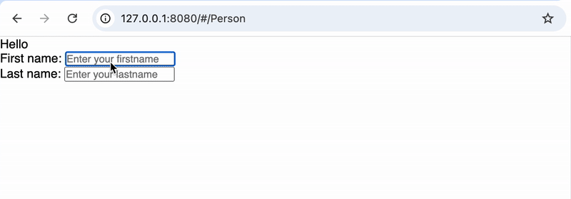
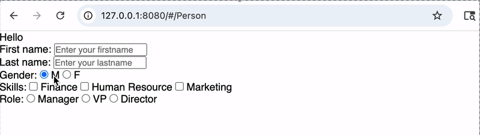
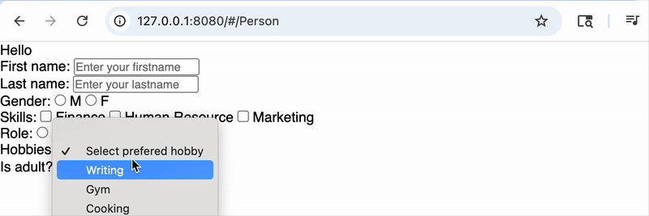

### Overview
- As known, form are one of the most ways and traditional user inputs approaches, hence, in Still.js they are part of the core features.


#### What you'll learn

<b> &nbsp;&nbsp;&nbsp; Two-way input Binding considering </b>
	<br> &nbsp;&nbsp;&nbsp; &nbsp;&nbsp;&nbsp; text, 
	<br> &nbsp;&nbsp;&nbsp; &nbsp;&nbsp;&nbsp; radio-button, 
	<br> &nbsp;&nbsp;&nbsp; &nbsp;&nbsp;&nbsp; check-box,
	<br> &nbsp;&nbsp;&nbsp; &nbsp;&nbsp;&nbsp; and Combobox (select)

<p></p>
<b> &nbsp;&nbsp;&nbsp; Validators </b>

<br>

#### The HTML Form tag in form Declaration
- In Still.js, when creating a form it's required to wrap all components within the `<form>` HTML tags, otherwise it won't work or it'll misbehave. Follow an example bellow:


#### Binding input text

=== "Person.html - template"
	```html title="Because the HTML file as the same name it's automatically bound to the .js as template. " hl_lines="11 16" linenums="1"
	<div>Hello @firstName @lastName</div>
	<form>
		<div>
			<label>First name:</label>
			<input (value)="firstName" placeholder="Enter your firstname">
		</div>
		<div>
			<label>Last name:</label>
			<input (value)="lastName" placeholder="Enter your lastname">
		</div>
	</form>
	```


=== "Person.js - component"
	```js title="" hl_lines="11 16" linenums="1"
    import { ViewComponent } from "../../@still/component/super/ViewComponent.js";

    export class Person extends ViewComponent {

        isPublic = true;

		firstName;
		lastName;

    }
	```

The form has two fields, First Name and Last Name, whose values are bound to the component's `firstName` and `lastName` state variables using the (value) directive. Also, they're bound to the tempate in the `Hello @firstName @lastName` statement.

Still.js supports 2-way binding, so changes to bound input fields automatically update the linked state variables and keep the UI reactive.





#### Binding Radio Button and/or Checkbox

=== "Person.html - template"
	```html title="Because the HTML file as the same name it's automatically bound to the .js as template. " hl_lines="6-7 12-17 23-27" linenums="1"
	<div>Hello @firstName @lastName</div>
	<form>
		<!-- First and Last name inputs above -->
		<div>
			<label>Gender:</label>
			<input type="radio" (value)="M" (labelAfter)="M" (field)="gender">
			<input type="radio" (value)="F" (labelAfter)="F" (field)="gender">
		</div>
		<div>
			<label>Skills:</label>
			<span (forEach)="skills">
				<input 
					each="item" 
					type="checkbox" 
					(labelAfter)="{item.name}" 
					(field)="selectedSkills" 
					(value)="{item.id}">
			</span>
		</div>
		<div>
			<label>Role:</label>
			<span (forEach)="roles">
				<input each="item" 
					type="radio" 
					(labelAfter)="{item.name}" 
					(field)="selectedRole" 
					(value)="{item.id}">
			</span>	
		</div>
	</form>
	```


=== "Person.js - component"
	```js title="" hl_lines="9-10 12-16 18-21" linenums="1"
    import { ViewComponent } from "../../@still/component/super/ViewComponent.js";

	export class Person extends ViewComponent {

		isPublic = true;

		firstName = '';
		lastName = '';
		selectedSkills;
		selectedRole;

		skills = [
			{id: 1, name: 'Finance'}, 
			{id: 2, name: 'Human Resource'}, 
			{id: 3, name: 'Marketing'}
		]

		roles = [
			{id: 1, name: 'Manager'}, 
			{id: 3, name: 'Director'}, 
		]

	}
	```

Two scenarios are being addressed in the template, we have the gender field with hard coded values, whereas Stills and Role fields are coming from lists and we're looping throug them.

Whereas input text and comboboxes bind is done via `(value)`, for Radio and Checkbox we use `(field)` while `(value)` is still used for the value itself instead for binding. `(value)` in the combo-box holds the actual value instead of the component binding variable.

Checkboxes and radio buttons in Still.js use a `label` directive with position suffixes like `Before` or `After` to control label placement relative to the input.




#### Binding Combobox (select)

=== "Person.html - template"
	```html title="Because the HTML file as the same name it's automatically bound to the .js as template. " hl_lines="7-12 16-20" linenums="1"
	<div>Hello @firstName @lastName</div>
	<form>
		<!-- First and Last name inputs above... -->
		<!-- Radio buttons and check boxes binding above... -->
		<div>
			<label>Hobbies:</label>
			<select 
				(forEach)="hobbiesList" 
				(value)="preferedHobby" 
				placeholder="Select prefered hobby">
				<option each="item" value="{item.code}">{item.name}</option>
			</select>	
		</div>
		<div>
			<label>Is adult?</label>
			<select (value)="isPersonAdult">
				<option value="">Select an option</option>
				<option value="1">Yes</option>
				<option value="0">No</option>
			</select>	
		</div>
	</form>
	```


=== "Person.js - component"
	```js title="" hl_lines="9-10 24-28" linenums="1"
    import { ViewComponent } from "../../@still/component/super/ViewComponent.js";

	export class Person extends ViewComponent {

		firstName = '';
		lastName = '';
		selectedSkills;
		selectedRole;
		preferedHobby;
		isPersonAdult;

		skills = [
			{id: 1, name: 'Finance'}, 
			{id: 2, name: 'Human Resource'}, 
			{id: 3, name: 'Marketing'}
		];

		roles = [
			{id: 1, name: 'Manager'}, 
			{id: 2, name: 'VP'}, 
			{id: 3, name: 'Director'}, 
		];

		hobbiesList = [
			{code: 1, name: 'Writing'},
			{code: 2, name: 'Gym'},
			{code: 3, name: 'Cooking'},
		];

	}
	```

For comboboxes, binding is done on the <b>`<select>`</b> element using `(value)`, and when options come from a list, a placeholder can be used.




### Form validation overview
Still.js provides with it's own validation capabilities which provides with a bunch of pre-defined ones. But also it allows custom validator to be added. Check <a href="../directive/#form-validation-directives">Form Validation Directive</a>.


### In Summary
Forms are core part of Still.js, supporting 2-way binding using the `(value)` directive in most cases. However, for comboboxes and checkboxes, binding is done with the `(field)` directive.

Fields bound to any form element are naturally available to be bound to the template, as well as can be listen to the changes reactively when changed.