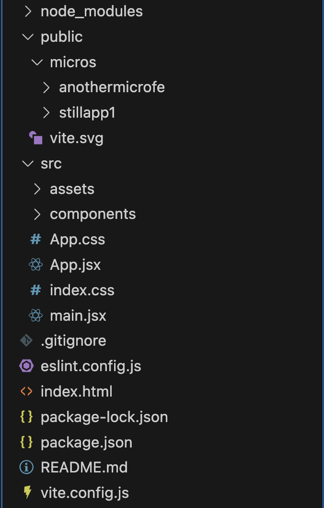

## Using Still.js for Microfrontend development into React

!!! info "Work in Progress - Completed Soon"

    We're still bringing and elaborating additional content which will be part of this page, please just be a bit patient, completed soon.

### Overview
Due to it's nature, Still.js provides advanced capabilities which allow it to integrate or being embedded inside applications developed with other Frameworks. This documentation is dedicated dedicated to integration with React.

Check <a href="../lone-component/">this</a> for microservices using Vanilla setup (e.g. PHP, JSP, ASP, Regular template engines, etc).

 

#### 1. Integration conditions

In order for Still.js to integrate with React, we have to add the Still app inside the React app in a folder that is not parsed by React itself. The considerations of this documentation focus on a project generated with Vite, anyway things will work the same for any other approach as long as project structure is followd accordingly.

Bellow is the example of a structure of a React project with Still.js inside the `public/` folder:

{width="300px" }

 

#### 2. Still.js available features under React as Microfrontend
Still.js is a full-featured framework, just as React it provides natively all those known capabilities (e.g. Navigation, Validation) and more. No matter how you're running your Still app, whether it's as microservice of as independent, same capabilities are provided. 

One of the interesting features that are 100% available is the navigation, you can yet navigate from one componet into another in your Microfrontend without impacting the regular React navigation, due to that, Still allow not only a component to be embedded, but a whole application.

 

#### 3. Installation and Setup
For more details about setting up, follow the <a href="https://www.npmjs.com/package/@stilljs/apploader">README on npm</a>, under the @stilljs/apploader.

<h2>Enjoy your coding.</h2>
 