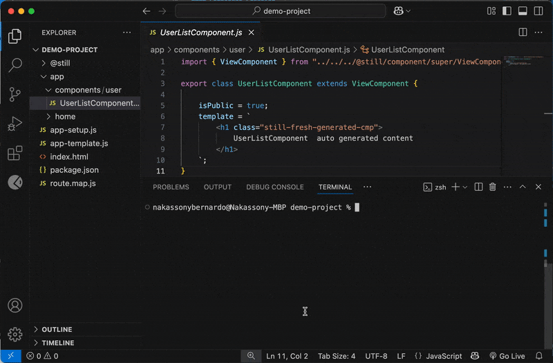

### Overview
<b>`still-cli`</b> is a Still framework tool which makes it easy to handle some of the recurrent and specific tasks (e.g. Development tasks phase) thereby helping to speed up the things in certain aspects.

Initially the CLI tool provides commands in 3 categories such as Application, Component and Routing, in this documentation, we'll summarize the focusing in the more recurrent and key command.

Once install CLI tools goes by <b>`stilljs`</b>, however it can be abreviated by <b>`stilljs`</b> or <b>`st`</b>. Just like the tool, the commands (e.g. create, route) and parameters (e.g. list) are also available through alias as can be seen when typing <b>`still --help`</b>.


!!! warning "Windows considerations"
    When using the CLI tool on Windows it might happen that the the installetion
    does not get identified in the path right after, in this case it can be used with npx prefix (e.g. <b>`npx still create component path/to-my/MyComponent`</b>)

<br>

#### Installation
Still CLI tool is provided through the NPM (Node Package Manager), and it has to be installed globally and not in a project scope:

```
npm install @stilljs/cli -g
```

<br>

#### Create a new project
In order to create a new project we have to have a folder in which we want the project to be, and inside this project I'll run the init command.
```js
// Bellow command needs to be ran from inside the project folder
still init
```


<br>

#### Component Creation
It's recommended to use the CLI tool when creating a component in Still, as this will not only generate the new component but also manage conflicts and routes. 

When creating a component, we have to specify the path, if folders of the path exists only the component will be created, otherwise both folder(s) and component will be created.
```
still create component app/components/user/UserListComponent
```


!!! info "Lone component creation"
    <a href="../lone-component/">Lone component</a> takes place in the use case where we're creating a Microfrontend or using Still.js framework through the CDN, therefore when creating a component in this context we need to specify the <b>`--lone`</b> flag in the end. (e.g. <b>`npx still create component path/to-my/MyComponent --lone`</b>)

<br/>

#### Listing routes
Routes is one of the core aspects of Still.js framework (check <a href="../routing">routing & navgation</a>), hence they are generate automatically when a component is created, and we can check on them also by using the CLI tool.
```js
// Bellow command needs to be ran from inside the project folder
still route list
```



<br/>
<br/>