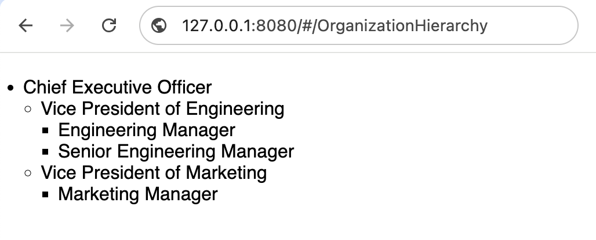
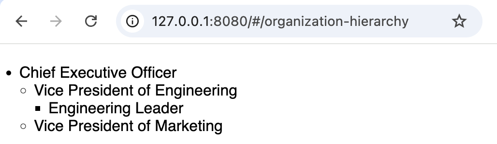
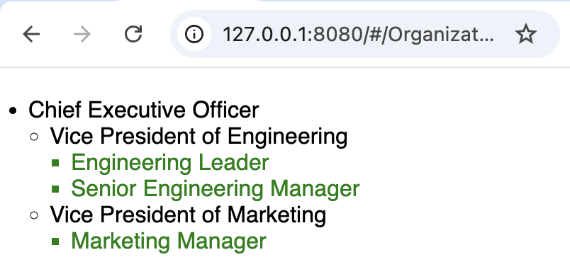
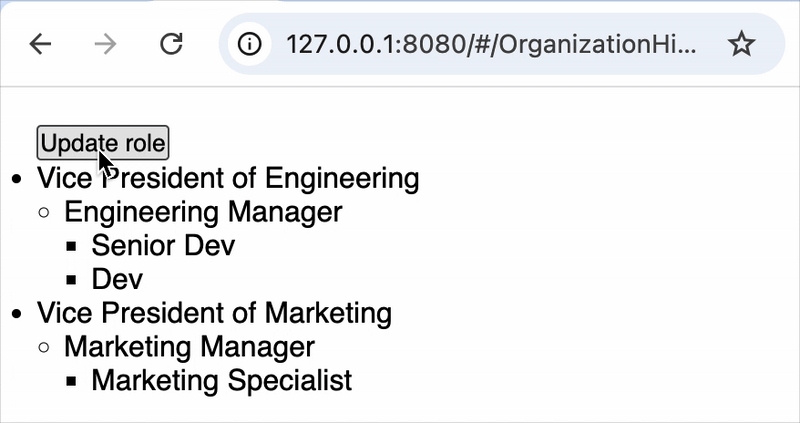
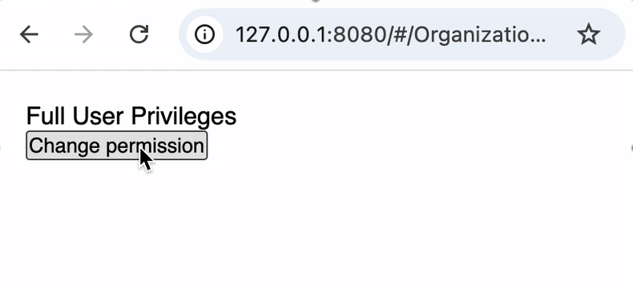
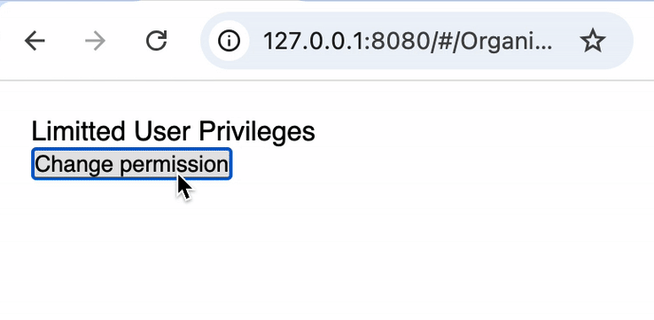

### Overview
As of version 1.3.0, Still.js supports template logic, allowing developers to control application flow directly in templates using <b>`@for`</b>, <b>`@if`</b>, or inline expressions like <b>`${ 'Five plus six is ' + (5 + 6) }`</b>.


### What you'll learn?
1. Looping through a list using <b>`@for`</b>
    a. Nested looping
    b. Trace the loop index
    c. Pass another component in the loop
    d. Use condition to control the loop output
2. Conditional rendering of the <b>`@for`</b> content without reactive effect (top-level <b>`@if`</b>)
3. Keep reactive effect while conditional rendering of the <b>`@for`</b> content (with <a href="../conditional-rendering/#the-showif-showif-directive-example"><b>`(showIf)`</b></a>)
4. Top Level conditional (<b>`@if`</b>).
5. Conditional CSS formatting.

<br>

### In template Looping with <b>`@for and @endfor (for)`</b>:

Supports nesting loops allowing to handle complex data structures and presenting data in a customized way.

The comming examples will be based in the following project structure:


    project-root-folder
    |__ @still/
    |__ app/
    |    |
    |    |__ components/ #-> This is component folder
    |    |   |__ OrganizationHierarchy.js
    |    |   |__ OrganizationHierarchy.html
    |    |   |__ organization-data.js
    |    |   |
    |__ config/
    |    |__ app-setup.js
    |    |__ route.map.js
    |__  ... #-> Remaining files


=== "organization-data.js"

    ```json title="Data" linenums="1"
    export const organizationData = [
        {
        "title": "Chief Executive Officer",
        "children": [ {
            "title": "Vice President of Engineering",
            "children": [ {
                "title": "Engineering Manager",
                "children": [
                    {"title": "Senior Software Engineer"},
                    {"title": "Software Engineer"}
                ]
                },
                {
                "title": "Senior Engineering Manager",
                "children": [ {"title": "Quality Assurance Engineer"} ]
                }
            ]
            },
            {
            "title": "Vice President of Marketing",
            "children": [ {
                "title": "Marketing Manager",
                "children": [ {"title": "Marketing Specialist"} ]
                }
            ]
            }]
        }
    ];
    ```

=== "OrganizationHierarchy.js"

    ```js title="Component" linenums="1" hl_lines="11-12"

    import { ViewComponent } from "../../@still/component/super/ViewComponent.js";
    import { ListState } from "../../@still/component/type/ComponentType.js";
    import { organizationData } from "./organization-data.js";

    export class OrganizationHierarchy extends ViewComponent {

        isPublic = true;

        // Data is coming from a js file, but could be API
        // ListState type is convinient for better experience
        /** @type { ListState<Array> } */
        rolesList = organizationData;

    }
    ```

=== "OrganizationHierarchy.html"

    ```html title="Template" linenums="1" hl_lines="3 7 11 13 16 19"
    <div style="padding: 20px;">
      <ul>
        @for(role in this.rolesList)
          <li>
            {role.title}
            <ul style="margin-left: 15px;">
              @for(subRole in role.children)
                <li>
                  {subRole.title}
                  <ul style="margin-left: 15px;">
                    @for(subSubRole in subRole.children)
                      <li>{subSubRole.title}</li>
                    @endfor
                  </ul>
                </li>    
              @endfor
            </ul>
          </li>
        @endfor
      </ul>
    </div>
    ```

<b>Result:</b>

{:width="500px" border="border:1px solid;"}


The example loops through a tree structure (from a file, could be API), printing items at each level. The outer most (first) <b>`@for`</b> references a component variable, so <b>`this.`</b> is required.

#### Fetching from API consideration
!!! warning Fetching from API

    When data is being fetched from the API, the state variables (list) needs to be initialized with a empty array ([]), in this case it would be as follow:
    ```js
        /** @type { ListState<Array> } */
        rolesList = [];
    ```

<br>

#### Looping using @for with conditional (@if)
We can also use conditional (<b>`@if`</b>) while looping with <b>`@for`</b>, follow the bellow example (between lines 12 and 14):


=== "OrganizationHierarchy.html"

    ```html title="Template" linenums="1" hl_lines="12-14"
    <div style="padding: 20px;">
      <ul>
        @for(role in this.rolesList)
          <li>
            {role.title}
            <ul style="margin-left: 15px;">
              @for(subRole in role.children)
                <li>
                {subRole.title}
                  <ul style="margin-left: 15px;">
                    @for(subSubRole in subRole.children)
                      @if(subSubRole.title.indexOf('Manager') < 0)
                        <li>{subSubRole.title}</li>
                      @endif
                    @endfor
                  </ul>
                </li>	
              @endfor
            </ul>
          </li>
        @endfor
      </ul>
    </div>
    ```

<b>Result:</b>

{:width="500"}

In the above case, from the template we're adding a condition to print only those roles that not contains **Manager** for the third hierarchy level.

<br>
<br>


#### Getting the record Index out of the loop

It's also get the index of the <b>`@for`</b> loop, we have to assign the <b>`$count`</b> constant to the variables name that will be used to trace the indexes.

=== "OrganizationHierarchy.html"

    ```html title="Template" linenums="1" hl_lines="7 3"
    <div style="padding: 20px;">
	  <ul>
	    @for(role in this.rolesList; idx = $count)
	  	<li>
	  	  {idx} - {role.title}
	  	  <ul style="margin-left: 15px;">
	  		@for(subRole in role.children; idx1 = $count)
	  		  <li>
	  			{idx1} - {subRole.title}
	  			<ul style="margin-left: 15px;">
	  			  @for(subSubRole in subRole.children)
	  				<li>{subSubRole.title}</li>
	  			  @endfor
	  			</ul>
	  		  </li>    
	  		@endfor
	  	  </ul>
	  	</li>
	    @endfor
	  </ul>
    </div>
    ```
<br>
<br>


#### Passing another component inside the loop

Like the (forEach) directive, we can pass another component inside the loop.

=== "OrganizationHierarchy.html"

    ```html title="Template" linenums="1" hl_lines="14-17"
    <div style="padding: 20px;">
      <ul>
        @for(role in this.rolesList)
          <li>
            {role.title}
            <ul style="margin-left: 15px;">
              @for(subRole in role.children)
                <li>
                  {subRole.title}
                  <!-- 
                    We scalar (e.g. String, number) property one by one
                    or we can pass a complex structure (json, array) as item 
                  -->
                  <st-element 
                      component="ManagedTeam" 
                      item="{subRole}">
                  </st-element>
                </li>  
              @endfor
            </ul>
          </li>
        @endfor
      </ul>
    </div>
    ```

=== "ManagedTeam.js + embedded template"

    ```js title="Template" linenums="1" hl_lines="9 12-16"
    import { ViewComponent } from "../../@still/component/super/ViewComponent.js";

    export class ManagedTeam extends ViewComponent {

        isPublic = true;

        // The bellow state variable maps from the passed
        // item (item="{subRole}") which is subRole JSON object 
        children;

        template = `
            <ul style="margin-left: 15px;">
              @for(role in this.children)
                  <li style="color: green;">{role.title}</li>
              @endfor
            </ul>
        `;
    }
    ```


<b>Result:</b>

{:width="500"}


<br>


#### Conditional formating and Defining each loop output id to leverage Partial DOM update

Partial dom update will happen through the top-most item of the for loop even when in nesting loop scenario, then this is where we need to set the id.

The id should be unique for each item, it needs to come from the data, not from the index. the field name needs to be id.

=== "OrganizationHierarchy.html"

    ```html title="Template" linenums="1" hl_lines="6 15-17"
    <div style="padding: 20px;">

	  <button (click)="updateRole()">Update role</button>
	  <ul>
	    @for(role in this.rolesList)
	      <li id="{role.id}">
	    	{role.title}
	    	<ul style="margin-left: 15px;">
	    	  @for(subRole in role.children)
	    	  <li>
	    		{subRole.title}
	  		    <ul style="margin-left: 15px;">
	  			  @for(subSubRole in subRole.children)
                    <!-- Bellow we're setting the text color conditionally -->
	  			    <li style="color: { subSubRole.title.indexOf('Senior') >= 0 ? 'green' : '' }">
	  				  {subSubRole.title}
	  			    </li>
	  			  @endfor
	  		    </ul>
	    	  </li>  
	    	  @endfor
	    	</ul>
	      </li>
	    @endfor
	  </ul>

    </div>
    ```

=== "OrganizationHierarchy.js + data"

    ```js title="Template" linenums="1" hl_lines="12-29 31-37"
    import { ViewComponent } from "../../@still/component/super/ViewComponent.js";
    import { ListState } from "../../@still/component/type/ComponentType.js";
    import { organizationData } from "./organization-data.js";

    export class OrganizationHierarchy extends ViewComponent {

        isPublic = true;

        // Data is assigned straight, but could come from API
        // ListState type is convinient for supporting .update
        /** @type { ListState<Array> } */
        rolesList = [
            {
                "id": 1,//First item unique id
                "title": "Vice President of Engineering",
                "children": [ {
                    "title": "Engineering Manager",
                    "children": [{"title": "Senior Dev"},{"title": "Dev"}]
                }]
            },
            {
                "id": 2,//Second item unique id
                "title": "Vice President of Marketing",
                "children": [ {
                    "title": "Marketing Manager",
                    "children": [ {"title": "Marketing Specialist"} ]
                }]
            }
        ];

        updateRole(){
            const role = this.rolesList.value[0];
            role.title = 'Senior VP of Eng';
            role.children[0].children[0].title = 'Tech Lead';		
            role.children[0].children[1].title = 'Senior Dev';		
            this.rolesList.update([role]);
        }

    }
    ```

When updating, we call the update method under the list, and we need to pass either the whoule list (updatet), or an array with every single update item.

Deletion capability is also available, then, when it comes to @for loop item we have to specify an array with the different elements to remove. E.g. `this.rolesList.delete([2])` will remove the Vice President of Marketing.

<b>Result:</b>

{:width="500"}

<br>


### Top Level conditional using @if/@endif (if)

Business Logic in the template allows us to used just any kind of JavaScript condition expression.

Every single conditiona validation has it's own bloack, else statement is not provided.

!!! info "General consideration"

    Except for the <b>`@for`</b> scenario, the content wrapped inside <b>`@if`</b> will be reactive according to the stated condition.

!!! warning "Exceptional case - When wrapping @for into @if"

    1. Wrapping <b>`@for`</b> inside <b>`@if`</b> (like lines 17 to 27 in bellow example) makes it behave like <a href="../conditional-rendering/#the-renderif-directive-example"><b>`(renderIf)`</b></a>: if the <b>`@if`</b> condition changes to true, the UI won’t automatically update.

    2. If reactivity (hide/unhide) is needed for the <b>`@for`</b> content, the recommended way is to used the <a href="../conditional-rendering/#the-showif-showif-directive-example"><b>`(showIf)`</b></a> directive.

=== "OrganizationHierarchy.js"

    ```js title="Component" linenums="1" hl_lines="14 16-21"

    import { ViewComponent } from "../../@still/component/super/ViewComponent.js";
    import { ListState } from "../../@still/component/type/ComponentType.js";
    import { organizationData } from "./organization-data.js";

    export class OrganizationHierarchy extends ViewComponent {

        isPublic = true;

        // Data is coming from a js file, but could be API
        // ListState type is convinient for better experience
        /** @type { ListState<Array> } */
        rolesList = organizationData;

        userPermission = 'regular';

        changePermission(){
            if(this.userPermission.value === 'Admin')
                this.userPermission = 'regular';
            else
                this.userPermission = 'Admin';
        }

    }
    ```

=== "OrganizationHierarchy.html"

    ```html title="Template" linenums="1" hl_lines="3-5 7-9 14 27"
    <div style="padding: 20px;">

	  @if(this.userPermission === 'Admin')
	    Full User Privileges
	  @endif
  
	  @if(this.userPermission !== 'Admin')
	    Limitted User Privileges
	  @endif
  
	  <br>
	  <button (click)="changePermission()">Change permission</button>
	  <br>
	  @if(this.userPermission === 'Admin')
	    <ul>
	  	@for(role in this.rolesList)
	  	  <li>
	  		{role.title}
	  		  <ul style="margin-left: 15px;">
	  		  @for(subRole in role.children)
	  			<li>{subRole.title}</li>  
	  		  @endfor
	  		</ul>
	  	  </li>
	  	@endfor
	    </ul>
	  @endif
  
    </div>
    ```

In the above example, since the userPermission is set to regular, the list won't be presented, and title value will be according.

<b>Result:</b>

{:width="500"}

If permission changes to admin at runtime, the title updates accordingly, but the tree does not, because it's generated from the loop, in this case <b>`@if`</b> behaves as <a href="../conditional-rendering/#the-renderif-directive-example"><b>`(renderIf)`</b></a>.

<br>


#### Using <a href="../conditional-rendering/#the-showif-showif-directive-example"><b>`(showIf)`</b></a> to hide @for content and keep reactivity

The (showIf) directive works especially with flags, hence they (flags) need to be annotated with <b>`@Prop`</b> annotation.

The directive is placed straight to our list tag (UL) thereby replacing the @if scope, but we could also use another outer container.

=== "OrganizationHierarchy.html"

    ```html title="Template" linenums="1" hl_lines="3-5 7-9 15 26"
    <div style="padding: 20px;">

      @if(this.userPermission === 'Admin')
        Full User Privileges
      @endif
    
      @if(this.userPermission !== 'Admin')
        Limitted User Privileges
      @endif
    
      <br>
      <button (click)="changePermission()">Change permission</button>
      <br>

      <ul (showIf)="self.hasPermission">
        @for(role in this.rolesList)
          <li>
          {role.title}
            <ul style="margin-left: 15px;">
              @for(subRole in role.children)
                <li>{subRole.title}</li>  
              @endfor
            </ul>
          </li>
        @endfor
      </ul>
  
    </div>
    ```


=== "OrganizationHierarchy.js"

    ```js title="Component" linenums="1" hl_lines="17-18 23 26"

    import { ViewComponent } from "../../@still/component/super/ViewComponent.js";
    import { ListState } from "../../@still/component/type/ComponentType.js";
    import { organizationData } from "./organization-data.js";

    export class OrganizationHierarchy extends ViewComponent {

        isPublic = true;

        // Data is coming from a js file, but could be API
        // ListState type is convinient for better experience
        /** @type { ListState<Array> } */
        rolesList = organizationData;

        userPermission = 'regular';

        // Flags in stilljs need to be annotated with @Prop
        /** @Prop */
        hasPermission = false;

        changePermission(){
            if(this.userPermission.value === 'Admin'){
                this.userPermission = 'regular';
                this.hasPermission = false;
            } else {
                this.userPermission = 'Admin';
                this.hasPermission = true;
            }
        }

    }
    ```

<b>Result:</b>

{:width="500"}

<br>

### Using inline expression for condition:

Inline block is especially for conditional scenario, except for loops (for) it supports whole <b>`if`</b> statements block with as well as <b>`else if`</b> as needed.

=== "OrganizationHierarchy.html"

    ```html title="Component" linenums="1" hl_lines="3"
    <div style="padding: 20px;">

    ${ this.userPermission === 'Admin' ? 'Full User Privileges' : 'Limitted User Privileges' }

    @if(this.userPermission === 'Admin')
    <ul>
        @for(role in this.rolesList)
        <li>
            {role.title}
            <ul style="margin-left: 15px;">
            @for(subRole in role.children)
                <li>{subRole.title}</li>	
            @endfor
            </ul>
        </li>
        @endfor
    </ul>
    @endif
    </div>
    ```

<style>
    img {
        border: 1px solid;
    }
</style>

The inline expression is also a good approach for conditional formating when outside the for loop.

<br>

### To conclude

Template logic in Still.js is a good alternative or complement to the template directives (line <b>`(forEach)`</b>, <b>`(showIf)`</b>, <b>`(renderIf)`</b>). 

Using nested @for loops and complex @if conditions allows handling complex scenarios within a single component, reducing the need for multiple embedded components and improving performance.
<br>


